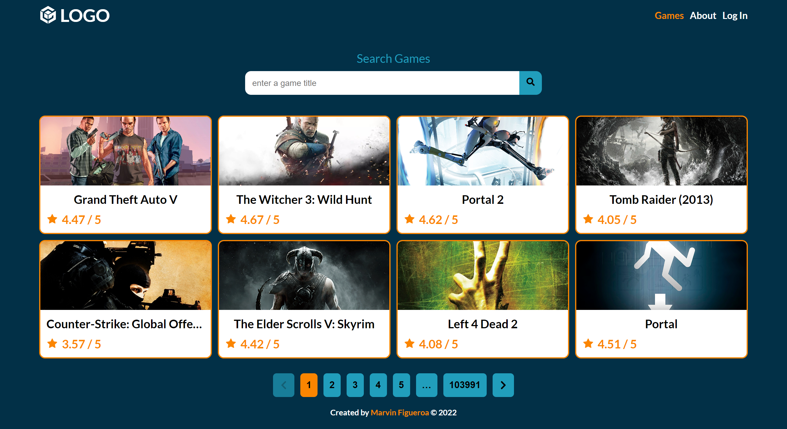
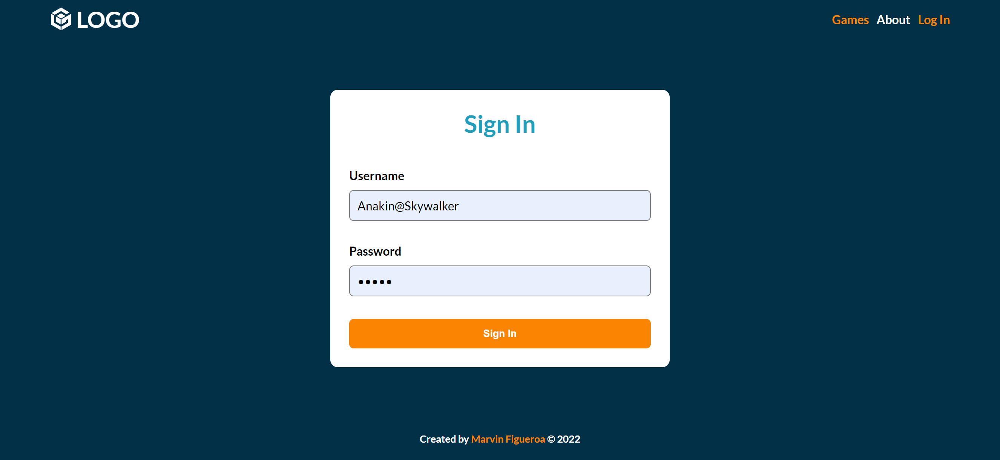
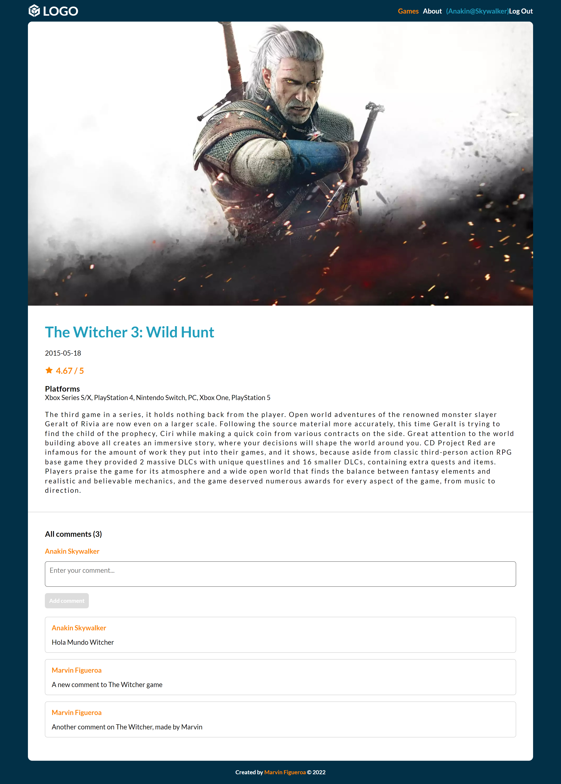
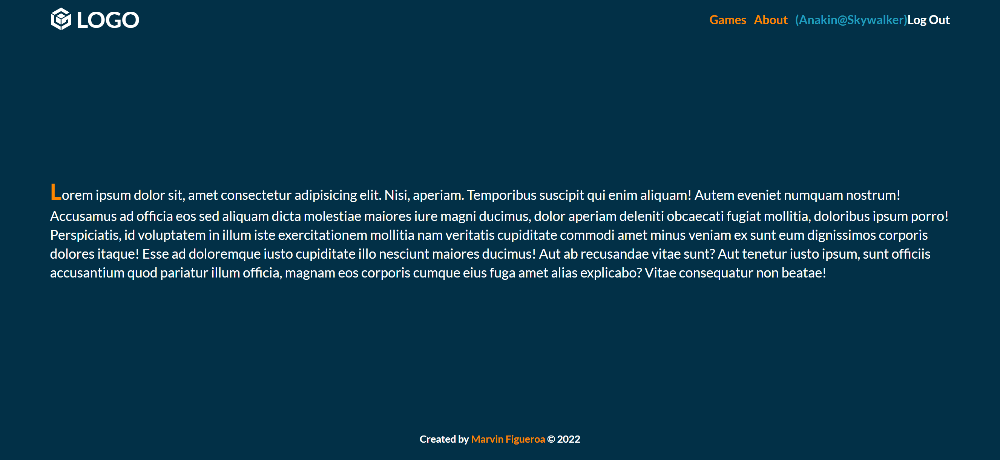
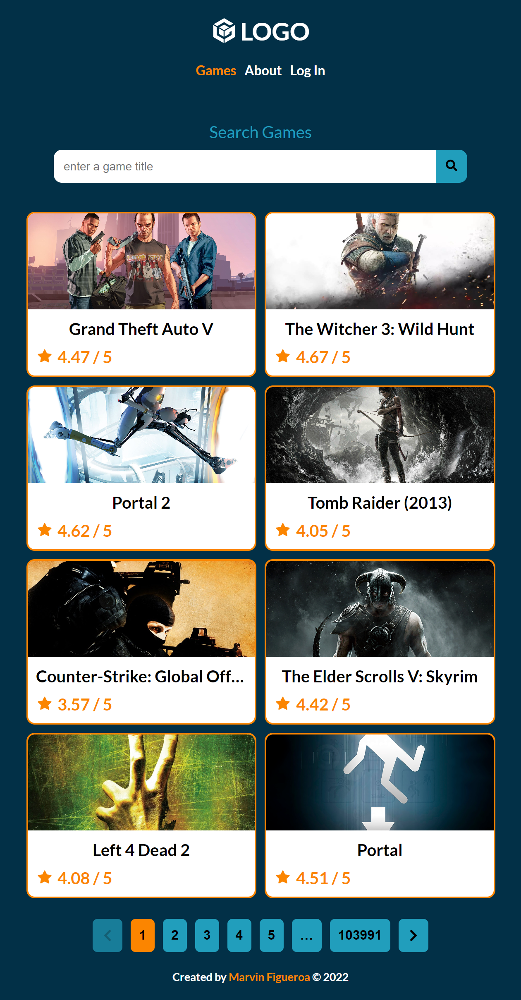

# Games App - RAWG API

## Description

The project consists of creating a website for a video game store using ReactJS and deploying json-server to the glitch platform to use it as a backend to interact with the game's data (comments and users) stored in the db.json file as well as the game data from the RAWG Games API. The website must allow the user to view the list of games (fetched from the RAWG API) using pagination, search for particular games using a search bar and also view the details of a particular game and its comments if there are any, as well as log in using localStorage to save/retrieve/remove the credentials in order to add comments to any game.

## Live Site

[Vercel Deployment](https://homework-week-5.vercel.app/)

## Built With

- Semantic HTML5 markup
- CSS Flexbox
- CSS Grid
- Desktop-First approach
- Sass / Scss
- JavaScript
- RAWG Games API
- Fetch API (GET, POST, PUT, PATCH)
- json-server deployed to glitch as a backend
- React JS Basics
- React Hooks
- react-icons package
- react-spinners package

## Visuals

**Screenshots Desktop #1**

**Screenshots Desktop #2**

**Screenshots Desktop #3**

**Screenshots Desktop #4**

**Screenshot Mobile**

